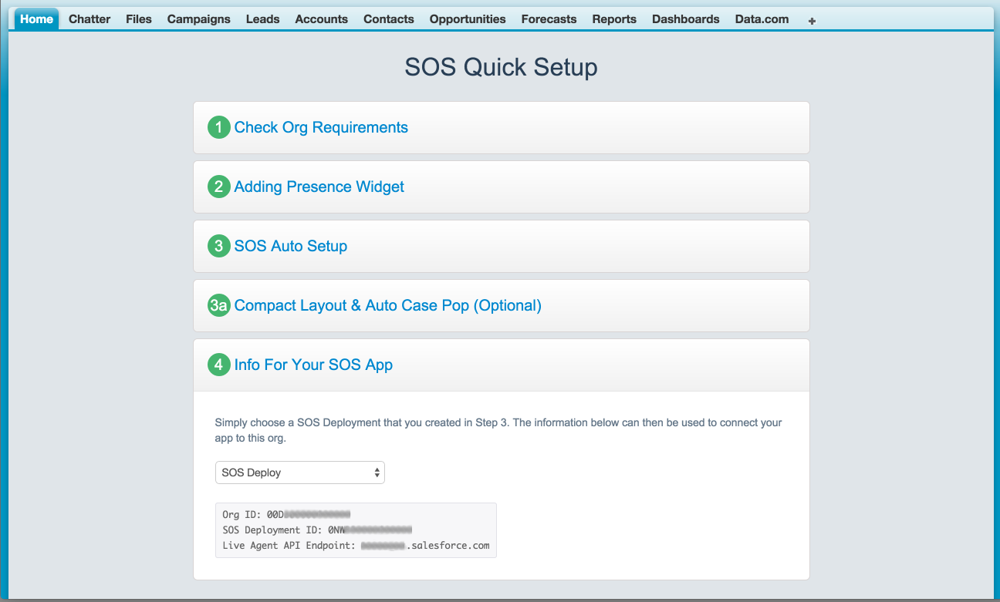
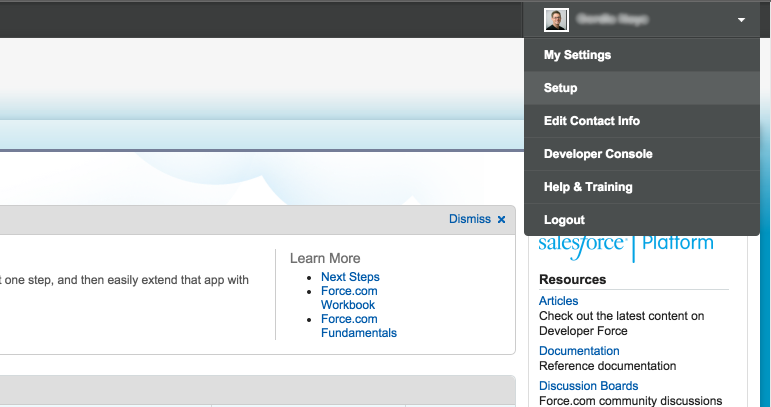
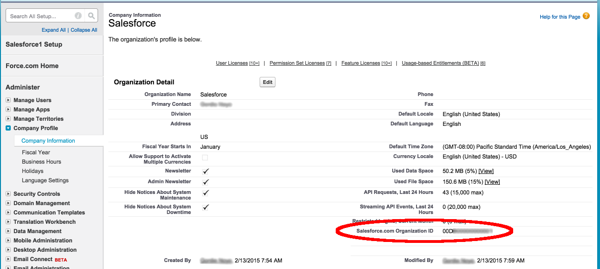
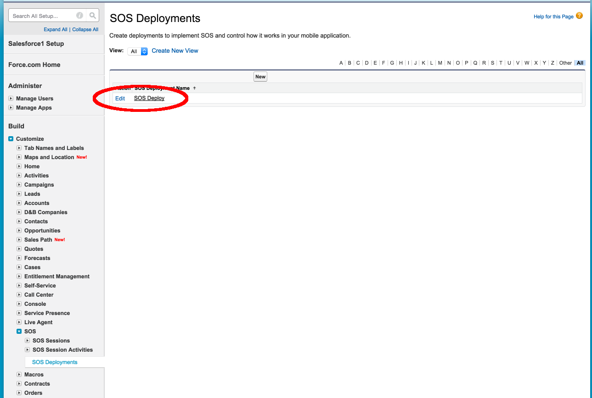
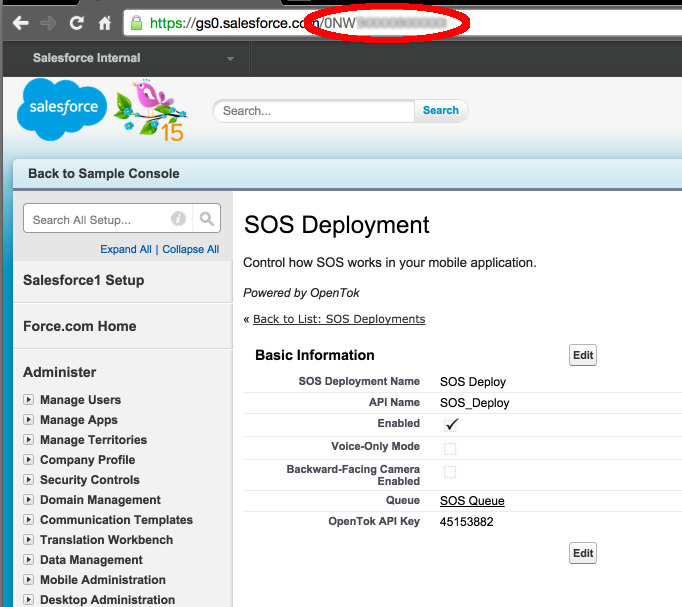
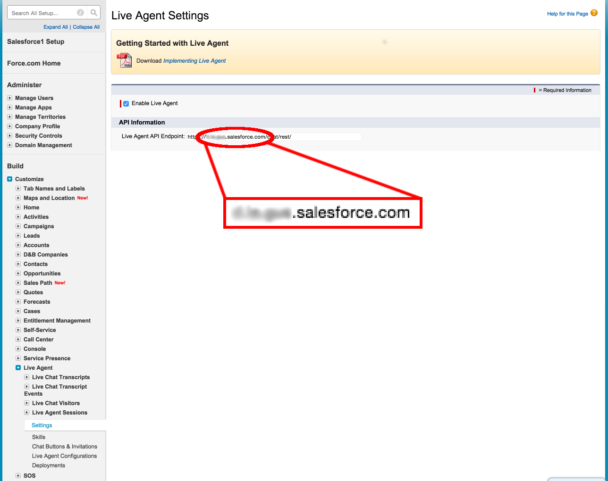

## Introduction
When you create an SOS session, you need to provide four pieces of information:
- **Contact Email** - This is the email address of a contact in your organization used to automatically populate new SOS issues (e.g. lauren@example.com).
- **Liveagent Pod** - The liveagent server that will be used to communicate between the SDK and salesforce (e.g. xx-1.x.salesforce.com).
- **Organization ID** - fifteen character identifier for your entire organization (e.g. 00Dxxxxxxxxxxxx).
- **Deployment ID** - fifteen character deployment identifier used to connect an incoming request to a specific queue (e.g. 0NWxxxxxxxxxxxx).

## If You Used SOS Quick Setup
If you used the SOS Quick Setup then most of the information required for an SOS session is available to you in step 4.

 
Simply select your deployment from the drop-down list and it will display the Organization ID, SOS Deployment ID, and Live Agent API Endpoint.

To select a contact email, you can get a list of all of your contacts by going to https://gs0.salesforce.com/003. From there, the email address of the contact to use for automatically generated SOS issues can be found.

## Without SOS Quick Setup
If you do not have access to the SOS Quick Setup then the information is still available but is spread throughout the setup.
#### Email
You can choose a contact email by going to your contacts page (https://gs0.salesforce.com/003).

#### Organization ID
Finding the Organization ID requires the following:
- Go to your Setup

- Select Administer -> Company Profile -> Company Information

#### Deployment ID
- Go to your Setup (as above)

- Select Build -> Customize -> SOS -> SOS Deployment

- Your Deployment ID is the fifteen character path name in the browser URL
 

#### Live Agent Pod
- Go to your Setup (as above)

- Select Build -> Customize -> Live Agent -> Live Agent Sessions -> Settings
- Your Live Agent Pod value is the server portion of the "Live Agent API Endpoint" URL (excluding "https://" and "/chat/rest").

